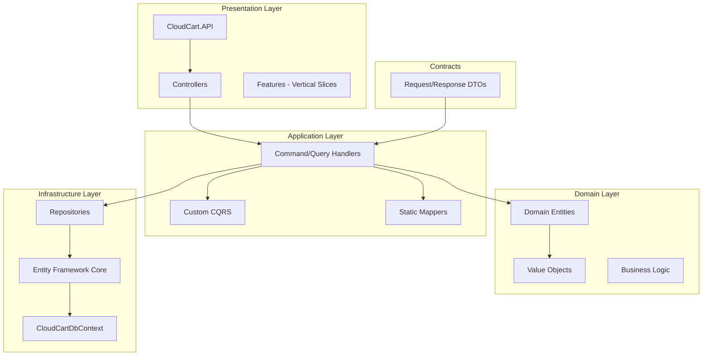

# CloudCart Architecture

## Overview

CloudCart implements **Clean Architecture** combined with **Vertical Slice Architecture** to create a maintainable, testable, and scalable e-commerce platform.

## Architecture Diagram



## Layer Responsibilities

### 1. Presentation Layer (CloudCart.API)

**Purpose**: HTTP endpoints and feature organization

**Key Components**:
- **Controllers**: Thin controllers that delegate to handlers
- **Features**: Vertical slices organized by business capability
- **Middleware**: Cross-cutting concerns (exception handling, logging)

**Pattern**: Each feature folder contains:
```
CreateProduct/
├── CreateProductCommand.cs
├── CreateProductCommandHandler.cs
└── CreateProductValidator.cs
```

### 2. Domain Layer (CloudCart.Domain)

**Purpose**: Core business logic and rules

**Key Components**:
- **Entities**: Rich domain models with behavior
- **Value Objects**: Immutable objects (Email, Address)
- **Enums**: Domain-specific enumerations

**Characteristics**:
- No dependencies on other layers
- Pure business logic
- Encapsulated state with factory methods
- Domain events (future enhancement)

### 3. Application Layer (CloudCart.Application)

**Purpose**: Orchestration and application logic

**Key Components**:
- **CQRS Abstractions**: `ICommand`, `IQuery`, handlers
- **Result Pattern**: Type-safe error handling
- **Repository Interfaces**: Persistence abstractions
- **Mappers**: Static mapping classes

### 4. Infrastructure Layer (CloudCart.Infrastructure)

**Purpose**: External concerns and persistence

**Key Components**:
- **DbContext**: EF Core configuration
- **Repositories**: Data access implementation
- **Configurations**: Fluent API entity configurations
- **Migrations**: Database schema versioning

### 5. Contracts Layer (CloudCart.Contracts)

**Purpose**: Data Transfer Objects

**Key Components**:
- **Requests**: Inbound DTOs
- **Responses**: Outbound DTOs
- **Shared Models**: Common response wrappers

## Vertical Slice Architecture

### What is Vertical Slice Architecture?

Instead of organizing code by technical layers (all controllers together, all services together), we organize by **features** (all code for "Create Product" together).

### Benefits

1. **Feature Cohesion**: Related code stays together
2. **Easy to Navigate**: Find all code for a feature in one place
3. **Reduced Coupling**: Features are independent
4. **Parallel Development**: Teams can work on different features
5. **Easy to Delete**: Remove entire features cleanly

### Example Structure

```
Products/
├── CreateProduct/
│   ├── CreateProductCommand.cs
│   ├── CreateProductCommandHandler.cs
│   └── CreateProductValidator.cs
├── GetProducts/
│   ├── GetProductsQuery.cs
│   └── GetProductsQueryHandler.cs
└── UpdateProduct/
    ├── UpdateProductCommand.cs
    ├── UpdateProductCommandHandler.cs
    └── UpdateProductValidator.cs
```

## Custom CQRS Pattern

### Core Interfaces

```csharp
public interface ICommand { }
public interface ICommandHandler<TCommand>
{
    Task<Result> HandleAsync(TCommand command, CancellationToken ct);
}

public interface IQuery<TResponse> { }
public interface IQueryHandler<TQuery, TResponse>
{
    Task<Result<TResponse>> HandleAsync(TQuery query, CancellationToken ct);
}
```

### Why Custom Implementation?

1. **No Magic**: Clear, explicit dependencies
2. **Performance**: No reflection overhead
3. **Learning**: Understand CQRS fundamentals
4. **Flexibility**: Full control over behavior
5. **Simplicity**: Minimal abstraction

## Result Pattern

### Purpose

Type-safe error handling without exceptions for business logic failures.

### Implementation

```csharp
public class Result
{
    public bool IsSuccess { get; }
    public bool IsFailure => !IsSuccess;
    public string Error { get; }

    public static Result Success() => new(true, string.Empty);
    public static Result Failure(string error) => new(false, error);
}

public class Result<T> : Result
{
    public T Value { get; }
}
```

### Benefits

- Forces error handling at compile time
- Clear separation between technical and business failures
- Readable code flow
- Easy to test

## Repository Pattern

### Purpose

Abstract data access and enable testing.

### Implementation

```csharp
public interface IRepository<T> where T : BaseEntity
{
    Task<T?> GetByIdAsync(Guid id, CancellationToken ct = default);
    Task<IReadOnlyList<T>> GetAllAsync(CancellationToken ct = default);
    Task<T> AddAsync(T entity, CancellationToken ct = default);
    // ... more methods
}
```

### Specialized Repositories

Each entity gets a specialized repository:
- `IProductRepository`: Product-specific queries
- `IOrderRepository`: Order-specific queries
- `ICartRepository`: Cart-specific queries

## Manual Mapping

### Why Manual Mapping?

1. **Explicitness**: See exactly what maps to what
2. **Performance**: No reflection overhead
3. **Debugging**: Easy to step through
4. **Control**: Handle complex scenarios easily
5. **Type Safety**: Compiler catches mapping errors

### Example

```csharp
public static class ProductMapper
{
    public static ProductResponse ToResponse(Product product)
    {
        return new ProductResponse
        {
            Id = product.Id,
            Name = product.Name,
            Price = product.Price,
            // ... explicit mapping
        };
    }
}
```

## Data Access Strategy

### Entity Framework Core Configuration

- **Fluent API**: All configurations in separate files
- **No Data Annotations**: Keep domain clean
- **Query Filters**: Global soft delete filter
- **Explicit Loading**: Control what gets loaded

### Soft Delete

All entities support soft delete:
```csharp
public abstract class BaseEntity
{
    public bool IsDeleted { get; protected set; }
    public void MarkAsDeleted() => IsDeleted = true;
}
```

Global query filter:
```csharp
modelBuilder.Entity<Product>()
    .HasQueryFilter(p => !p.IsDeleted);
```

## Testing Strategy

### Unit Tests

- Test handlers in isolation
- Mock repositories
- Focus on business logic
- Fast execution

### Integration Tests

- Test entire API endpoints
- Use in-memory database
- Verify end-to-end flows
- Slower but comprehensive

### Target: >80% Coverage

## Technology Choices

| Decision | Choice | Rationale |
|----------|--------|-----------|
| Framework | .NET 9 | Latest features, performance |
| ORM | EF Core 9 | Code-first, migrations, LINQ |
| Validation | FluentValidation | Expressive, testable |
| Logging | Serilog | Structured logging |
| Testing | xUnit + FluentAssertions | Industry standard |

## Future Enhancements

1. **Domain Events**: Decouple business logic
2. **Caching**: Redis for read models
3. **Message Bus**: Async processing with RabbitMQ
4. **API Versioning**: Support multiple versions
5. **Authentication**: JWT with Identity
6. **Rate Limiting**: Protect against abuse
7. **Health Checks**: Monitor system health

## Design Principles

1. **SOLID Principles**: All layers follow SOLID
2. **DRY**: Reusable components
3. **YAGNI**: Build what's needed now
4. **KISS**: Keep it simple
5. **Separation of Concerns**: Clear boundaries

## Conclusion

CloudCart demonstrates how to build a production-ready system using Clean Architecture and Vertical Slices without heavy dependencies like MediatR or AutoMapper. The architecture prioritizes:

- **Simplicity**: Easy to understand and maintain
- **Performance**: Minimal overhead
- **Testability**: Easy to test all layers
- **Flexibility**: Easy to extend and modify
